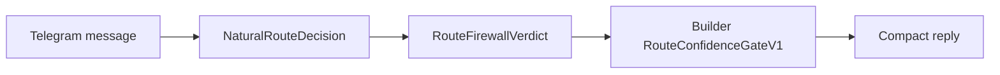

# Route Confidence Gate Adapter V1

Status: design checkpoint for the first release slice.

Owner: `spark-telegram-bot`

## Purpose

Telegram is the field console. It should detect read-only route/status questions, call the Builder-owned gate, and render the answer compactly.

Telegram must not become the durable memory authority, provider truth owner, or route-confidence authority.

## First Supported Question

```text
Which LLM took the latest Spawner job?
```

This must be treated as a read-only status question. It must not start a mission.

## Adapter Flow



## Reply Policy

If the gate returns `explain/high`:

```text
Latest Spawner job used <provider/model>. Evidence: mission-control + agent-events. Trace: present, redacted.
```

If the gate returns missing evidence:

```text
I cannot prove the latest Spawner provider yet.
Missing: <source-owned evidence>.
Run /board or /diagnose, then ask again.
```

If the route classifier is unsure:

```text
Do you want live Spawner status, mission board details, or a new run?
```

## Edge Cases

| Edge case | Telegram behavior |
| --- | --- |
| Message contains `job`, `mission`, `build`, or `LLM` | Keep read-only if phrased as a status question |
| User asks "run the latest job" | Require normal run authority, not route status |
| Builder gate unavailable | Say Builder gate is unavailable; suggest `/diagnose`; do not answer from memory |
| Gate returns partial evidence | Render missing evidence, not a guessed provider |
| Pending clarification is active | Current explicit status question wins unless the user directly answers the clarification |
| Shadow arbiter disagrees | Keep deterministic route/firewall result; arbiter stays telemetry |
| Raw chat/user/provider output appears in gate payload | Drop reply and surface privacy blocker |

## Data Boundary

Telegram replies may mention:

- provider/model label when source-owned evidence exists
- joined source families
- trace presence as redacted
- missing evidence labels

Telegram replies must not include:

- raw prompt
- chat id or user id
- provider output
- memory body
- transcript body
- raw audio
- env value
- secret
- artifact body

## Tests

Add focused tests for:

- status question does not start `/run`
- "which LLM took latest Spawner job" routes to Builder gate
- missing Builder gate does not answer from memory
- missing provider evidence returns a missing-proof reply
- payload with forbidden keys is rejected
- compact reply formatting

